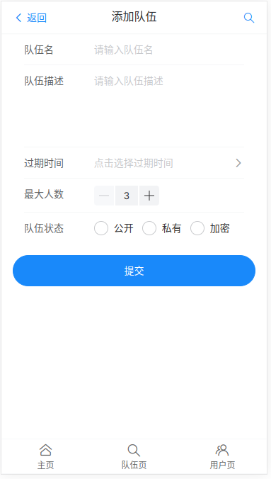

# 伙伴匹配系统

预览图

1.主页


2.主页(匹配模式) 当前登录用户标签进行匹配


3.队伍页


加入队伍


添加队伍





搜索用户(后续补充标签)


3. 个人页


修改信息


已加队伍


> author:zqy
>
> group:爆肝春蕾计划
>
> version:1.0
>
> date:2023/1/21
>
> 接口文档 `localhost:8080/api/doc.html`

## 需求分析

1.用户添加标签，标签进行分类  学习方向（java、c++） 工作/大学

2.主动搜索：孕育用户根据标签去搜索其他用户

​	1.缓存(Redis)

3.组队（前后端同学的进行一个组队之类的）

​	1.创建队伍

​	2.加入队伍

​	3.根据标签，队伍ID等查询队伍

​	4.邀请其他人

4.允许用户修改标签

5.推荐的算法

​	1.相似度计算算法+本地分布式计算


## 技术栈

**基于移动端的H5网页**

前端

1.Vue3

2.Vant UI(基于Vue的移动端组件库)

3.Vite（打包工具）

4.Nginx单机部署


后端

1.Java

2.ssm框架+mybatisPlus

3.MySQL数据库

4.Redis缓存

5.Swagger+Knife4j接口文档


## Day1

### 1.前端初始化

#### 脚手架

- Vite
- VueCLI

####  整合组件库

- 安装vant
- 导入依赖
- 使用按需导入的插件

#### 界面设计

 	1. 多参考
 	2. 从整体到局部
 	3. 先构思（美工，UI），再进行代码

导航条：展示当前页面名称

主页搜索框

内容部分

tab栏：

- 主页
- 队伍页
- 个人页

2.数据库表设计

3.开发前端，后端，根据标签搜索用户接口


## Day2

数据库表的设计

### 标签表（分类表）

建议用标签，而不是用分类，更灵活。

 标签分类 

性别：男、女

方向：Java、C++、Go、前端

正在学：Spring

目标：考研、春招、秋招、社招、考公、竞赛（蓝桥杯）、转行、跳槽

段位：初级、中级、高级、王者

身份：小学、初中、高中、大一、大二、大三、大四、学生、待业、已就业、研一、研二、研三

状态：乐观、有点丧、一般、单身、已婚、有对象

还可以支持用户自己定义标签。


### 表设计(tag)

id int 主键
标签名 varchar 非空（必须唯一，唯一索引）
上传标签的用户 userId int（如果要根据 userId 查已上传标签的话，最好加上，普通索引）
父标签 id ，parentId，int（分类）
是否为父标签 isParent, tinyint（0 不是父标签、1 - 父标签）
创建时间 createTime，datetime
更新时间 updateTime，datetime
是否删除 isDelete， tinyint（0、1）


### 修改用户表

**根据实际需求**

1.直接在用户表补充tags字段,存json字符串(*)

优点：查询方便、不用新建关联表，标签是用户的固有属性（除了该系统、其他系统可能要用到，标签是用户的固有属性）节省开发成本查询用户列表，查关系表拿到这 100 个用户有的所有标签 id，再根据标签 id 去查标签表。哪怕性能低，可以用缓存。

缺点：用户表多一列，会有点

2.再创建一个关联表

查询灵活，可以正查反查

缺点：要多建一个表、多维护一个表重点：企业大项目开发中尽量减少关联查询，很**影响扩展性，而且会影响查询性能**  (注意高内聚,低耦合)


### 开发后端接口

#### 搜索标签

1.用户传入多个标签,全部存在才搜索出来 like '%Java%' and like '%C++%'。

2.用户传入多个标签,有一个存在就会搜索出来  like '%Java%' or like '%C++%'。


SQL查询

```java
public List<CommonResult<User>> searchUserByTags(List<String> tagNameList) {
    if (CollectionUtils.isEmpty(tagNameList)) {
        throw new ResultException(ErrorCode.NULL_ERROR);
    }

    QueryWrapper<User> userQueryWrapper = new QueryWrapper<>();
    //and 语句
    for (String tagName : tagNameList) {
        userQueryWrapper = userQueryWrapper.like("tags", tagName);
    }
    System.out.println(userQueryWrapper);
    List<User> users = userMapper.selectList(userQueryWrapper);
    return users.stream().map(this::cleanUser).collect(Collectors.toList());
}
```


内存查询

```java
public List<CommonResult<User>> memorySearch(List<String> tagNameList) {
    if (CollectionUtils.isEmpty(tagNameList)) {
        throw new ResultException(ErrorCode.NULL_ERROR);
    }
    QueryWrapper<User> userQueryWrapper = new QueryWrapper<>();
    List<User> users = userMapper.selectList(userQueryWrapper);
    Gson gson = new Gson();
    return users.stream().filter(user -> {
        String tags = user.getTags();
        Set<String> tempTagNameSet = gson.fromJson(tags, new TypeToken<Set<String>>() {
        }.getType());
        tempTagNameSet = Optional.ofNullable(tempTagNameSet).orElse(new HashSet<>());

        for (String s : tempTagNameSet) {
            if (!tempTagNameSet.contains(s)) {
                return false;
            }
        }
        return true;

    }).map(this::cleanUser).collect(Collectors.toList());
}
```


先将用户数据搜索出来,然后通过操作获得标签


**这里选择内存查询法**


## Day3

前端整合路由（Vue-Router)

`在 config/route.ts`里面编写路由信息

```tsx
import User from "../pages/UserPage.vue"
import Team from "../pages/Team.vue"
import Search from "../pages/SearchPage.vue"
import Edit from "../pages/UserEditPage.vue"
import Index from "../pages/Index.vue"

const routes = [
    {path: '/', component: Index},
    {path: '/group', component: Team},
    {path: '/user', component: User},
    {path: '/search', component: Search},
    {path: '/user/edit', component: Edit}
]
export default routes
```


完善搜索框和搜索页(联合Tag标签和TreeSelect分类选择)


## Day4

### 补充前端界面

用户信息页[vant cell单元格](https://vant-contrib.gitee.io/vant/#/zh-CN/cell#zhan-shi-jian-tou)

更新页[vant from 表单](https://vant-contrib.gitee.io/vant/#/zh-CN/form#ji-chu-yong-fa ) 

**数据的传递**

```javascript
const toEdit = (editKey: string, editName: string, editValue: string) => {
  router.push({
    path: '/user/edit',
//使用vue进行传递参数
    query: {
      editKey,
      editName,
      editValue
    }
  })
}
```

通过useRoute获得静态路由的参数

```javascript
import {useRoute} from "vue-router";
//获得跳转路由的数据
const route=useRoute()
const editUser=ref({
  editKey: route.query.editKey,
  editName: route.query.editName,
  editValue: route.query.editValue
})
```

### 爬虫

拿取数据的方式

1.f12 查看现成接口

2.后台管理的方式 进行一个数据提取


### 后端整合swagger+Knife4接口文档

> 什么是接口文档？写接口信息的文档，每条接口包括：
>
> - 请求参数
> - 响应参数
> - 错误码
> - 接口地址
> - 接口名称
> - 请求类型
> - 请求格式
> - 备注
>
> who 谁用？一般是后端或者负责人来提供，后端和前端都要使用
>
> 为什么需要接口文档？
>
> - 有个书面内容（背书或者归档），便于大家参考和查阅，便于 **沉淀和维护** ，拒绝口口相传
> - 接口文档便于前端和后端开发对接，前后端联调的 **介质** 。后端 => 接口文档 <= 前端
> - 好的接口文档支持在线调试、在线测试，可以作为工具提高我们的开发测试效率
>
> 怎么做接口文档？
>
> - 手写（比如腾讯文档、Markdown 笔记）
> - 自动化接口文档生成：自动根据项目代码生成完整的文档或在线调试的网页。Swagger，Postman（侧重接口管理）（国外）；apifox、apipost、eolink（国产）
>
> 接口文档有哪些技巧？
>
> Swagger 原理：
>
> 1. 引入依赖（Swagger 或 Knife4j：https://doc.xiaominfo.com/knife4j/documentation/get_start.html）
> 2. 自定义 Swagger 配置类
> 3. 定义需要生成接口文档的代码位置（Controller）
> 4. 千万注意：线上环境不要把接口暴露出去！！！可以通过在 SwaggerConfig 配置文件开头加上 @Profile({"dev", "test"}) 限定配置仅在部分环境开启
> 5. 启动即可
> 6. 可以通过在 controller 方法上添加 @Api、@ApiImplicitParam(name = "name",value = "姓名",required = true) @ApiOperation(value = "向客人问好") 等注解来自定义生成的接口描述信息

如果 springboot version >= 2.6，需要添加如下配置：

更改了springmvc的路径匹配策略

```yml
spring:
  mvc:
    pathmatch:
      matching-strategy: ant_path_matcher
```


### 存量用户信息导入及同步

使用爬虫等方法获取数据

#### 读取数据

[Easy Excel](https://easyexcel.opensource.alibaba.com/qa/read)

```java
/com/example/studypartner/once
===ImportExcel 导入Excel文件，进行读取
===TableListener 监听器
=== Userinfo 设置读取数据的对象    
```


读取对象的方式

1.确定表头：建立确定的对象

2.不确定表头：每一行映射为Map<key,value>

两种读取模式：

1. 监听器：先创建监听器、在读取文件时绑定监听器。

单独抽离处理逻辑，代码清晰易于维护；一条一条处理，**适用于数据量大的场景**。

1. 同步读：无需创建监听器，一次性获取完整数据。(返回List类型数据)

方便简单，但是数据量大时会有等待时常，也可能内存溢出。


#### 导入数据


```java
import org.apache.commons.lang3.StringUtils; 

isEmpty和isBlank的区别在于

isEmpty仅仅是判断空和长度为0字符串

isBlank判断的是空，长度为0，空白字符（包括空格，制表符\t，换行符\n，换页符\f，回车\r）组成的字符串。
    
导入数据库前的去重
public class ImportSQL {
    public static void main(String[] args) {
        String fileName = "/home/wuxie/桌面/Data.xlsx";
        List<UserInfo> list = EasyExcel.read(fileName).head(UserInfo.class).sheet().doReadSync();
        System.out.println(list.size());
        //进行昵称去重
        Map<String, List<UserInfo>> collect = list.stream().filter(userInfo -> StringUtils.isNotEmpty(userInfo.getUsername()))
                .collect(Collectors.groupingBy(userInfo -> userInfo.getUsername()));
        for (Map.Entry<String, List<UserInfo>> stringListEntry : collect.entrySet()) {
            if (stringListEntry.getValue().size()>1){
                System.out.println("重复的username:"+stringListEntry.getKey());
                System.out.println("1");
            }
        }
        System.out.println("不重名的昵称数"+collect.size());
    }
}
```


## Day5

### 完善搜索详情页面

通过标签搜索用户

Vue-Router传值

[编程式导航](https://router.vuejs.org/zh/guide/essentials/navigation.html#%E5%AF%BC%E8%88%AA%E5%88%B0%E4%B8%8D%E5%90%8C%E7%9A%84%E4%BD%8D%E7%BD%AE)

1.query(url searchparams)

缺点：同时获取的值会在地址栏中显示出来，并且刷新页面，打印的值不会消失。传递值长度有限

`localhost:8080/#/xxx?id=2`

2.params

这种方法获取传值不会在地址栏中显示，但刷新页面打印的数据会消失

3.动态路由拼接传值

```tsx
routes: [
    {
      path: `/brother/:id/:name`,
      name: 'brother',
      component:brother
    }
  ]
```

`localhost:8080/#/6/zqy`


新增`/page/SearchResulePage` 信息搜索结果页

使用[商品Card卡片](https://vant-contrib.gitee.io/vant/#/zh-CN/card)


### 后端接口创建

新增UserController方法

```java
@GetMapping("/search/tags")
public CommonResult<List<CommonResult<User>>> searchUsersByTags(@RequestParam(required = false) List<String> tags) {
    if(CollectionUtils.isEmpty(tags)){
        throw new ResultException(ErrorCode.NULL_ERROR);
    }
    List<CommonResult<User>> userList = userService.searchUserByTags(tags);
    return ResultUtils.success(userList);
}
```

#### 跨域问题

1.使用`@CrossOrigin(origins = {"http://localhost:5173/"})`spring注解

2.添加配置文件

```java
package com.example.studypartner.config;

import org.springframework.context.annotation.Configuration;
import org.springframework.web.servlet.config.annotation.CorsRegistry;
import org.springframework.web.servlet.config.annotation.WebMvcConfigurer;

@Configuration
public class WebMvcConfg implements WebMvcConfigurer {

    @Override
    public void addCorsMappings(CorsRegistry registry) {
        //设置允许跨域的路径
        registry.addMapping("/**")
            //设置允许跨域请求的域名
            //当**Credentials为true时，**Origin不能为星号，需为具体的ip地址【如果接口不带cookie,ip无需设成具体ip】
            /* 放自己的前端域名*/
            .allowedOrigins("http://localhost:5173")
            //是否允许证书 不再默认开启
            .allowCredentials(true)
            //设置允许的方法
            .allowedMethods("*")
            //跨域允许时间
            .maxAge(3600);
    }
}

```

3.注意mybatis-plus默认开启了驼峰转下划线

```yaml
mybatis-plus:
  configuration:
#    mybatis-plus 关闭驼峰转换下划线功能
    map-underscore-to-camel-case: false
# 增加统一前缀/api
server:
  servlet:
    context-path: /api
```


### 前端对接接口

#### 封装axios

新增plugins目录

`/plugins/MyAxios`

```js
// Set config defaults when creating the instance
//自定义实例默认值
import axios from "axios";

const myAxios = axios.create({
    baseURL: 'http://localhost:8080/api'
});

//拦截器
// 添加请求拦截器
myAxios.interceptors.request.use(function (config) {
    // 在发送请求之前做些什么
    console.log("请求发送了",config)
    return config;
}, function (error) {
    // 对请求错误做些什么
    return Promise.reject(error);
});

// 添加响应拦截器
myAxios.interceptors.response.use(function (response) {
    // 对响应数据做点什么
    console.log("请求收到了了",response)
    return response;
}, function (error) {
    // 对响应错误做点什么
    return Promise.reject(error);
});

export default myAxios;

```

#### 搜索结果页请求接口

使用`onMunted`

1.注意传递数组参数的格式

2.标签JSON字符串转为js对象

```js
onMounted(async () => {
  const userListData = await myAxios.get('/user/search/tags', {
    params: {
      tags: tags
    },
      //传递数组参数的格式
    paramsSerializer: {
      serialize: params => qs.stringify(params, {indices: false})
    }
  }).then(function (response) {
    console.log("/user/search/tags" + response)
    showSuccessToast("请求成功")
    return response.data?.data
  }).catch(function (error) {
    console.log("/user/search/tags" + error)
    showFailToast("请求失败")
  })
  if (userListData) {
    userListData.forEach(user => {
      if (user) {
          //注意转换格式
        user.data.tags = JSON.parse(user.data.tags)
      }
    })
  }
    //因为后端返回数据的封装过多
  userList.value=userListData.map(function (item){
    return item.data
  })
  console.log(userList)
  // useList.value=userListData
})
```


### 分布式session

种 session 的时候注意范围，cookie.domain

aaa.zqy.com

bbb.zqy.com

两者的域名不同,那么发送请求的时候不会带相同的cookie

如果种一个更高层的公共域名 比如wuxie.aaa.zqy.com  wuxie.bbb.zqy.com

就可以共享cookie


如果使用session进行存储数据的话,那么不同服务器登录后,其内容不共享.所以使用共享存储

1.Redis

2.mysql

3.文件服务器ceph


引入Redis相关的依赖

```xml
//引入redis 能够操作redis
<dependency>
    <groupId>org.springframework.boot</groupId>
    <artifactId>spring-boot-starter-data-redis</artifactId>
    <version>2.6.4</version>
</dependency>
//引入spring-session与redis的整合,自动将session存储到redis中
<dependency>
    <groupId>org.springframework.session</groupId>
    <artifactId>spring-session-data-redis</artifactId>
    <version>2.6.3</version>
</dependency>
```

修改配置

```yaml
  session:
    timeout: 86400
    //redis 表示从redis中读写session,none表示存储在单台服务器
    store-type: redis
```


切换jdk

[JWT优缺点](https://zhuanlan.zhihu.com/p/108999941)


## Day6

### 用户个人信息修改接口

`/UserServiceImpl/updateUser`

```java
将获得的参数以及当前登录用户进行鉴权	
//todo 判断前端传入参数是否为空，是空那么就不进行  抛出异常
if (!isAdmin(loginUser) && !id.equals(loginUser.getId())) {
    throw new ResultException(ErrorCode.NOT_ADMIN);
}
User selectUser = userMapper.selectById(id);
```

---

### 登录页

[表单组件](https://vant-contrib.gitee.io/vant/#/zh-CN/form)

新增`/pages/UserLoginPage`

### 种cookie

前端通过登录接口`/user/login`向session里面添加用户信息，然后跳转到个人信息页获得登录用户信息`/user/current`从session提取.  但两者不同请求所带的cookie不同,所以无法得到信息

#### 前端添加凭证

`/plugins/MyAxios`

```tsx
const myAxios = axios.create({
    baseURL: 'http://localhost:8080/api'
});
//带上凭证
myAxios.defaults.withCredentials=true
```

#### 后端设置cookie允许在哪个域名下可携带

```yaml
# 增加统一前缀/api
server:
  servlet:
    context-path: /api
    session:
      cookie:
        domain: localhost
```


### 用户信息修改完善

新建`states/user.ts` 来进行 用户状态的全局获取

```tsx
import {UserType} from "../models/user";

let currentUser: UserType

const setCurrentUserState = (user: UserType) => {
    currentUser = user
}

const getCurrentUserState = (): UserType => {
    return currentUser
}
export {
    setCurrentUserState,
    getCurrentUserState
}

```

新建`service/user.ts` 用户数据全局获取

```tsx
import myAxios from "../plugins/MyAxios";
import {getCurrentUserState, setCurrentUserState} from "../state/user";

export const getCurrentUser = async () => {
    //先从本地进行查找
    const currentUser=getCurrentUserState()
    if (currentUser){
        return currentUser
    }
    //本地没有 就进行远程搜索
    const res = await myAxios.get("/user/current")
    if (res.code == 0) {
        //后端查找到就存储在本地
        setCurrentUserState(res.data)
        return res.data
    }
    return null
}

```


修改`pages/UserEditPage`

```js
const onSubmit = async () => {

  const currentUser = await getCurrentUser();
   //修改前判断是否登录
  if (!currentUser) {
    showFailToast("用户未登录")
    return
  }
  const result = await myAxios.post('/user/change', {
    'id': currentUser.id,
    //动态传参
    [editUser.value.editKey]: editUser.value.editValue
  });
  if (result.code === 0&&result.data>0) {
    showSuccessToast("更新成功")
    router.push("/user")
  } else {
    showFailToast("更新失败")
  }

};
```

## Day7

### 开发主页

(默认推荐与自己兴趣相当的用户)

使用List获得数据

### 数据导入

1.用可视化界面，一次性导入，数据量可控

2.写程序：for循环，建议分批导入，太大数量不方便控制，数据库压力会过大。（需要保证可控）

3.执行sql语句 适合数据量小的

### 定时任务

```java
//fixedDelay 任务结束到任务开始的延迟时间，设置为Long.MAX_VALUE 很长
//    @Scheduled(initialDelay = 5000,fixedDelay = Long.MAX_VALUE)
public void doInsertUsers() {
    StopWatch stopWatch = new StopWatch();
    stopWatch.start();
    final int sum = 10;
    System.out.println(sum);
    //        for (int i = 0; i < sum; i++) {
    //            User user = new User();
    //            user.setUsername("无邪苦");
    //            user.setUserAccount("wuxie");
    //            user.setAvatarUrl("https://xingqiu-tuchuang-1256524210.cos.ap-shanghai.myqcloud.com/5339/5e926a2bb7773958.jpg");
    //            user.setGender(1);
    //            user.setUserPassword("123456");
    //            user.setEmail("123");
    //            user.setPhone("123");
    //            user.setUserRole(0);
    //            user.setCity("dada");
    //            user.setProfile("dad");
    //            user.setProvince("dada");
    //            user.setTags("[]");
    //            userMapper.insert(user);
    //
    //        }
    stopWatch.stop();
    System.out.println(stopWatch.getLastTaskTimeMillis());
}
```


### 数据插入/并发插入

注意打包时会跑一遍单元测试，所以需要删除或忽略测试


for循环插入数据的问题

1.建立和释放数据库连接

2.for循环是绝对线性的, 上一条执行会影响后续的


#### Mybatis Plus 伪批量插入

在前面[《新增数据》](https://www.quanxiaoha.com/mybatis-plus/mybatisplus-insert.html) 小节中，我们已经知道了 Mybatis Plus 内部封装的批量插入 `savaBatch()` 是个**假的批量插入**，示例代码如下：

```
List<User> users = new ArrayList<>();
for (int i = 0; i < 5; i++) {
    User user = new User();
    user.setName("犬小哈" + i);
    user.setAge(i);
    user.setGender(1);
    users.add(user);
}
// 批量插入
boolean isSuccess = userService.saveBatch(users);
System.out.println("isSuccess:" + isSuccess);
```

通过打印实际执行 SQL , 我们发现还是一条一条的执行 `INSERT`:


并且还带着大家看了内部实现的源码，这种方式比起自己 `for` 循环一条一条 `INSERT` 插入数据性能要更高，原因是在**会话这块做了优化**，虽然实际执行并不是真的批量插入。


#### 并发插入

并发要注意执行的先后顺序，且分批的份数所导致的运行时间问题与CPU核数有关。

如果分出的份数大于CPU核数，那么就会有某个核运行多份任务，所以最好线程设置符合CPU核数


// CPU 密集型：分配的核心线程数 = CPU - 1

// IO 密集型：分配的核心线程数可以大于 CPU 核数

```java
private ExecutorService executorService = new ThreadPoolExecutor(12, 1000, 1000, TimeUnit.MINUTES, new ArrayBlockingQueue<>(1000));

```


```java
    public void doConcurrencyInsertUsers() {
        StopWatch stopWatch = new StopWatch();
        stopWatch.start();
        final int sum = 1000;
        int j = 0;
        ArrayList<CompletableFuture> completableFutures = new ArrayList<>();
        for (int i = 0; i < 20; i++) {
            ArrayList<User> users = new ArrayList<>();
            while (true) {
                j++;
                User user = new User();
                user.setUsername("无邪苦");
                user.setUserAccount("wuxie");
                user.setAvatarUrl("https://xingqiu-tuchuang-1256524210.cos.ap-shanghai.myqcloud.com/5339/5e926a2bb7773958.jpg");
                user.setGender(1);
                user.setUserPassword("123456");
                user.setEmail("123");
                user.setPhone("123");
                user.setUserRole(0);
                user.setCity("dada");
                user.setProfile("dad");
                user.setProvince("dada");
                user.setTags("[]");
                users.add(user);
                if (j % 50 == 0) {
                    break;
                }
            }
            //创建异步任务
            CompletableFuture<Void> future = CompletableFuture.runAsync(() -> {
                userService.saveBatch(users, 50);
            }, executorService);
            //任务加入集合
            completableFutures.add(future);
        }
        //allOf组合多个CompletableFuture
        CompletableFuture.allOf(completableFutures.toArray(new CompletableFuture[]{})).join();
        stopWatch.stop();
        System.out.println(stopWatch.getLastTaskTimeMillis());
    }
```


### 分页查询

添加分页拦截器

```java
@Configuration
public class MybatisPlusConfiguration {
    //配置分页拦截器
    @Bean
    public MybatisPlusInterceptor getMybatisPlusInterceptor(){
        MybatisPlusInterceptor interceptor = new MybatisPlusInterceptor();
        interceptor.addInnerInterceptor(new PaginationInnerInterceptor());
        return interceptor;
    }
}

```

不配置分页拦截器查询的时候selectPage默认**查询全部**

接口更改

```java
@GetMapping("/recommend")
public CommonResult<Page<User>> recommend(long pageSize, long pageNum, HttpServletRequest request) {
    QueryWrapper<User> userQueryWrapper = new QueryWrapper<>();
    Page<User> page = userService.page(new Page<>(pageNum, pageSize), userQueryWrapper);
    return ResultUtils.success(page);
}
```


```js
  const userListData = await myAxios.get('/user/recommend', {
    params: {
      pageSize: 5,
      pageNum: 1
    },
    // paramsSerializer: {
    //   serialize: params => qs.stringify(params, {indices: false})
    // }
  }).then(function (response) {
    console.log("/user/recommend" + response)
    showSuccessToast("请求成功")
    //最后page类的返回值封装为records
    return response?.data?.records
  })
```


TODO

> 数据库慢？预先把数据查出来，放到一个更快读取的地方，不用再查数据库了。（缓存）
>
> 
>
> 预加载缓存，定时更新缓存。（定时任务）
>
> 
>
> 多个机器都要执行任务么？（分布式锁：控制同一时间只有一台机器去执行定时任务，其他机器不用重复执行了）


## Day8

### 数据查询慢解决方案

使用缓存：提前将数据取出来保存好，然后客户端就从缓存中进行读取数据，而不是每次都从数据库里面查找数据

### 缓存实现

- Redis（分布式缓存）
- memcached（分布式）
- Etcd（云原生架构的一个分布式存储，**存储配置**，扩容能力）
- ehcache（单机缓存)

 容易导致数据不一致

-  本地缓存（Java 内存 Map）
-  Caffeine（Java 内存缓存，高性能）

基于Google的Guava Cache，Caffeine提供一个性能卓越的本地缓存(local cache) 实现, 也是SpringBoot内置的本地缓存实现。(Caffeine性能是Guava Cache的6倍)

-  Google Guava

### 实现方式

- Spring-Data-Redis
- Spring Data：
- - 通用的数据访问框架，定义了一组 增删改查 的接口mysql、redis、jpa 简化数据库的访问
- Jedis：	
- - (独立于 Spring 操作 Redis 的 Java 客户端，要配合 Jedis Pool 使用)
- Lettuce
- - **高阶** 的操作 Redis 的 Java 客户端
  - 异步、连接池  (连接池的作用:**复用**)
- Redisson
- - 分布式操作 Redis 的 Java 客户端，让你像在使用本地的集合一样操作 Redis（分布式 Redis 数据网格）

### 对比

1. 如果你用的是 Spring，并且没有过多的定制化要求，可以用 Spring Data Redis，最方便
2. 如果你用的不是 Spring，并且追求简单，并且没有过高的性能要求，可以用 Jedis + Jedis Pool
3. 如果你的项目不是 Spring，并且追求高性能、高定制化，可以用 Lettuce，支持异步、连接池
4. 如果你的项目是分布式的，需要用到一些分布式的特性（比如分布式锁、分布式集合），推荐用 redisson


### Redis

> NoSQL数据库
>
> key-value 存储系统 
>
>
> 常见数据结构
>
> String  name：“wuxie”
>
> List   names:["wuxie","wuxie"]
>
> Hash  names:["wuxie":1,"jwj":2]  
>
> Zset 
>
> Set   names:["wuxie"]   不重复


> bloomfilter（布隆过滤器，主要从大量的数据中快速过滤值，比如邮件黑名单拦截）
>
> geo（计算地理位置）
>
> hyperloglog（pv 页面访问量 / uv 用户访问量）
>
> pub / sub（发布订阅，类似消息队列）
>
> BitMap （1001010101010101010101010101）**list是有序可重复，而set是无序不可重复**
>
> 

引入

```xml
<dependency>
    <groupId>org.springframework.boot</groupId>
    <artifactId>spring-boot-starter-data-redis</artifactId>
    <version>2.6.4</version>
</dependency>
```

配置

```yaml
  redis:
    password: 123
    port: 6379
    host: localhost
    database：0 #数据源选择
```


反序列化配置 (防止传入数据为乱码	)

原因 RedisTemplate 源码内容

```java
public void afterPropertiesSet() {
    super.afterPropertiesSet();
    boolean defaultUsed = false;
    if (this.defaultSerializer == null) {
        this.defaultSerializer = new JdkSerializationRedisSerializer(this.classLoader != null ? this.classLoader : this.getClass().getClassLoader());
    }
```


```java
/**
 *
 *  自定义序列化
 *
 */
@Configuration
public class RedisTemplateConfig {

    @Bean
    public RedisTemplate<String, Object> redisTemplate(RedisConnectionFactory connectionFactory) {
        //创建RedisTemplate对象
        RedisTemplate<String, Object> redisTemplate = new RedisTemplate<>();
        //设置连接工厂
        redisTemplate.setConnectionFactory(connectionFactory);
        //设置Key的序列化
        redisTemplate.setKeySerializer(RedisSerializer.string());

        //创建Json序列化工具
        GenericJackson2JsonRedisSerializer jsonRedisSerializer = new GenericJackson2JsonRedisSerializer();
        //设置Value的序列化
        redisTemplate.setValueSerializer(jsonRedisSerializer);

        return redisTemplate;
    }
}
```


### 数据缓存

修改`UserController/recommend 接口`

不同用户看到的数据不同

`systemId:moduledId:func:options` 不要与其他存储冲突

**注意为缓存设置过期时间,Redis的存储内容是有限的** （这部分应该写到service里面 注意优化）

```java
public CommonResult<Page<User>> recommend(long pageSize, long pageNum, HttpServletRequest request) {
    User loginUser = userService.getLoginUser(request);
    String rediskey = String.format("wuxie:user:recommend:%s", loginUser.getId());
    ValueOperations valueOperations = redisTemplate.opsForValue();
    
    //先从缓存里面读取数据，没有再从数据库里面查找
    Page<User> userPage = (Page<User>) valueOperations.get(rediskey);
    if (userPage != null) {
        ResultUtils.success(userPage);
    }
    //写缓存,并且设置缓存时间
    QueryWrapper<User> userQueryWrapper = new QueryWrapper<>();
    Page<User> page = userService.page(new Page<>(pageNum, pageSize), userQueryWrapper);
    try {
        valueOperations.set(rediskey, page, 30000, TimeUnit.SECONDS);
    } catch (Exception e) {
        log.error("redis set key-value error");
    }
    return ResultUtils.success(page);
}
```


### 定时任务/数据预热

问题：第一个用户访问还是很慢（加入第一个老板），也能一定程度上保护数据库

优点：

1. 解决上面的问题，使得用户始终访问很快

缺点：

1. 增加开发成本
2. 预热的时机和时间如果错了，有可能你缓存的数据不对或者太老
3. 占用额外空间

> 分析优缺点时候，要开发思路，整个项目从0到1的链路上进行分析


#### 实现

1.定时任务

1. 使用线程创建定时任务
2. 使用 `TimerTask` 创建定时任务
3. 使用线程池创建定时任务
4. 使用 `Quartz` 框架实现定时任务
5. 使用 `@Scheduled` 注解实现定时任务
6. `xxl-job` 实现分布式定时任务

2.模拟触发（手动触发）


注意点：

1. 缓存预热的意义（新增少，总用户多）  用户多查询所耗时间较长
2. 缓存空间不能过大，要预留其他缓存空间
3. 注意缓存数据的周期（此处每天一次）

[corn 生成器1](https://cron.qqe2.com/)

[cron生成器2](https://www.matools.com/crontab/)


#### 使用方式

1.在Application上添加注解`@EnableScheduling`

2.定时任务上使用` @Scheduled 注解`


新建文件`/job/PreCacheJob`

```javascript
private List<Long> mainUsers = Arrays.asList(4L); //设置登录用户
@Scheduled(cron = "0 0 0 * * * ")
public void doCacheRecommendUser() {
    QueryWrapper<User> userQueryWrapper = new QueryWrapper<>();
    Page<User> page = userService.page(new Page<>(1, 5), userQueryWrapper);
    String rediskey = String.format("wuxie:user:recommend:%s", mainUsers);
    ValueOperations valueOperations = redisTemplate.opsForValue();
    try {
        valueOperations.set(rediskey, page, 30, TimeUnit.SECONDS);
    } catch (Exception e) {
        log.error("PreCache is error", e);
    }
}

```


## Day9

### **控制定时任务的执行**

1.浪费资源，如果每台服务器都设置了定时任务，那么多台服务器同时启动会浪费资源等

2.脏数据，比如重复插入

---

### **要控制定时任务在同一时间内只有一台服务器能执行**

1.分离定时任务程序和主程序，只在 1 个服务器运行定时任务。单机运行，成本太大

2.**<u>写死配置</u>** ,指定某台服务器进行,判断其IP地址. 

**单机就会存在单点故障**

优点:成本较低

缺点:IP可能是不固定.  

3.<u>**动态配置**</u> 

优点:   配置是可以轻松的、很方便地更新的（**代码无需重启**），但是只有 ip 符合配置的服务器才真实执行业务逻辑。

缺点：服务器多了、IP 不可控还是很麻烦，还是要人工修改

- - 数据库
  - Redis
  - 配置中心（Nacos、Apollo、Spring Cloud Config)

4.<u>**分布式锁**</u> 只有抢到锁的服务器才能执行业务逻辑.

优点:不用手动配置,多台服务器只需要争取锁即可

缺点:增加成本

**有限资源的情况下，控制同一时间（段）只有某些线程（用户 / 服务器）能访问到资源。**

或者是单机服务下,多个线程下要指定线程的执行情况

Java 实现锁：**synchronized 关键字**、并发包的类

问题：只对单个 JVM 有效,就无法保证其他服务器内的线程执行顺序

---

### 为什么需要分布式锁

1.在有限资源情况下,控制同一时间只有某些线程(用户,服务器)能访问到资源

2.单个锁只能对单个JVM有效,无法保证其他服务器

核心思想：先来的用户将数据设置为自己的标识（服务器IP等),其他服务器访问时发现被获取就进行等待释放

[分布式锁实现](https://blog.csdn.net/jiandanokok/article/details/114296755?ops_request_misc=%257B%2522request%255Fid%2522%253A%2522167189130116782425179973%2522%252C%2522scm%2522%253A%252220140713.130102334..%2522%257D&request_id=167189130116782425179973&biz_id=0&utm_medium=distribute.pc_search_result.none-task-blog-2~all~top_positive~default-1-114296755-null-null.142^v68^control,201^v4^add_ask,213^v2^t3_control2&utm_term=%E5%88%86%E5%B8%83%E5%BC%8F%E9%94%81&spm=1018.2226.3001.4187)

- 基于数据库

`select xxx for update`

- 基于Redis

主要是基于命令：`SETNX key value`

- 基于zookeeper

<div style="color:red">注意事项:</div>

1. 用完锁要释放（腾地方）
2. **锁一定要加过期时间 **
3. 如果方法执行时间过长，锁提前过期了？问题：

1. 1. 连锁效应：释放掉别人的锁
   2. 这样还是会存在多个方法同时执行的情况

​	解决方案：续期,过期前判断该任务执行是否完毕,完毕就释放,未完毕就续费

```java
boolean end = false;

//线程
new Thread(() -> {
    //判断状态
    if (!end)}{
        续期
    })

    end = true;
```

5.提前释放锁,先判断该锁是否为自己的,否则释放锁时刚好过期,就释放了别人的锁了

```sql
// 原子操作
if(get lock == A) {
    // set lock B
    del lock
}
```

Redis+lua脚本实现


### Redission实现分布式锁

*Redisson*是架设在Redis基础上的一个Java驻内存数据网格

实现了很多 Java 里支持的接口和数据结构

Redisson 是一个 java 操作 Redis 的客户端，**提供了大量的分布式数据集来简化对 Redis 的操作和使用，可以让开发者像使用本地集合一样使用 Redis，完全感知不到 Redis 的存在。**

1. spring boot starter 引入（不推荐，版本迭代太快，容易冲突）https://github.com/redisson/redisson/tree/master/redisson-spring-boot-starter
2. 直接引入：    Quick start(快速开始)

```xml
<dependency>
   <groupId>org.redisson</groupId>
   <artifactId>redisson</artifactId>
   <version>3.19.2</version>
</dependency>  
```

3.编写配置类

```java
/**
 * Redission配置
 */
@Configuration
//从yaml里面获取数据，方便动态修改
@ConfigurationProperties(prefix = "spring.redis")
@Data  (bean对象要有get 和set 的方法，所以使用了@Data注解)
public class RedissonConfig {
    private String host;
    private String port;
    @Bean
    public RedissonClient redissonClient() {
        // 1. Create config object 配置
        Config config = new Config();
        String redisAddress = String.format("redis://%s:%s", host, port);
        config.useSingleServer()
                .setAddress(redisAddress)
                .setDatabase(1)
                .setPassword("123");
        // 2. Create Redisson instance 实例
        RedissonClient redisson = Redisson.create(config);
        return redisson;
    }
}

```


优化`PreCache.java`

```java
public void doCacheRecommendUser() {
    RLock lock = redissonClient.getLock("wuxie:precachejob:docache:locak");
    try {
        if (lock.tryLock(0, -1, TimeUnit.SECONDS)) {
            for (Long mainUser : mainUsers) {
                QueryWrapper<User> userQueryWrapper = new QueryWrapper<>();
                Page<User> page = userService.page(new Page<>(1, 5), userQueryWrapper);
                String rediskey = String.format("wuxie:user:recommend:%s", mainUser);
                ValueOperations valueOperations = redisTemplate.opsForValue();
                try {
                    valueOperations.set(rediskey, page, 30, TimeUnit.SECONDS);
                } catch (Exception e) {
                    log.error("PreCache is error", e);
                }
            }
        }
    } catch (InterruptedException e) {
        log.error("doCacheRecommendUser is error", e);
    } finally {
        //最后判断该锁是否为自己的,然后进行释放
        if (lock.isHeldByCurrentThread()) {
            System.out.println("unlock:" + Thread.currentThread().getId());
            lock.unlock();
        }
    }

}
```


### 看门狗机制(逾期问题)

https://blog.csdn.net/qq_26222859/article/details/79645203

> 开一个监听线程，如果方法还没执行完，就帮你重置 redis 锁的过期时间。
>
> ```java
> lock.tryLock(0, -1, TimeUnit.SECONDS)
> 只有过期时间为默认的-1才会启动看门狗机制,否则不会续期
> ```
>
> 原理：
>
> 1. 监听当前线程，默认过期时间是 30 秒，每 10 秒续期一次（补到 30 秒） 时间设置是防止宕机
> 2. 如果线程挂掉（注意 debug 模式也会被它当成服务器宕机），则不会续期
>
> 20s的时候就会续期


### 思考

Redisson和spring-data-redis的区别？

：spring-data-redis是可以对Redis进行操作。而Redisson也可对Redis进行操作。他们之间区别在哪，或者说侧重在哪。我当时想到的是Redisson可以对Redis集群操作。有兴趣的可以自己搜搜一下。

红锁


## Day10

### 组队功能

#### 需求分析

类似王者荣耀组队功能，

> 设置组队的人数限制
>
> 队伍名称（标题）
>
> 队伍描述
>
> 过期时间
>
> 分享队伍，邀请其他用户加入
>
> - 生成链接
> - 生成二维码
>
> 队伍的私密性（私人，公开等）
>
> 用户创建队伍的上限
>
> 用户是否可以加入队伍（人满，技术限制，队长审核）
>
> 用户退出队伍，（队长解散或者转让队长权限）
>
> 根据标签，用户搜索队伍
>
> 队伍人满发送通知

### 实现

#### 数据库表设计

`team 队伍表`

- id 唯一表示 bigint
- userId 加入用户Id
- name  队伍名称
- description 队伍描述
- expireTIme 队伍过期时间
- maxNum 队伍人数限制
- status 队伍状态 （ 0 公开 1 私人 2 加密）
- password 私密密码
- creteTime 创建时间
- updateTime 更新时间
- isDelete 逻辑删除

`user_team 用户和队伍之间的映射`  (创建映射表，或者在队伍表添加已加入用户ID，用户表添加已加入队伍字段)

- id 
- teamId
- userId
- joinTIme
- createTIme
- updateTIme
- isDelete

```sql
=================== 队伍表
create table team
(
    id           bigint auto_increment comment 'id'
    primary key,
    name   varchar(256)                   not null comment '队伍名称',
    description varchar(1024)                      null comment '描述',
    maxNum    int      default 1                 not null comment '最大人数',
    expireTime    datetime  null comment '过期时间',
    userId            bigint comment '用户id',
    status    int      default 0                 not null comment '0 - 公开，1 - 私有，2 - 加密',
    password varchar(512)                       null comment '密码',

    createTime   datetime default CURRENT_TIMESTAMP null comment '创建时间',
    updateTime   datetime default CURRENT_TIMESTAMP null on update CURRENT_TIMESTAMP,
    isDelete     tinyint  default 0                 not null comment '是否删除'
)
    comment '队伍';
    
======================映射表
create table user_team
(
    id           bigint auto_increment comment 'id'
    primary key,
    userId            bigint comment '用户id',
    teamId            bigint comment '队伍id',
    joinTime datetime  null comment '加入时间',
    createTime   datetime default CURRENT_TIMESTAMP null comment '创建时间',
    updateTime   datetime default CURRENT_TIMESTAMP null on update CURRENT_TIMESTAMP,
    isDelete     tinyint  default 0                 not null comment '是否删除'
)
    comment '用户队伍关系';
```

#### 编写接口(TeamController)

##### 请求包装类(`request/TeamAddInfo`)

只需要前端传入指定的内容

```java
package com.example.studypartner.domain.request;

import lombok.Data;

import java.io.Serializable;
import java.util.Date;

/**
 * @author wuxie
 */
@Data
public class TeamAddInfo  implements Serializable {


    /**
     * 队伍名称
     */
    private String name;

    /**
     * 描述
     */
    private String description;

    /**
     * 最大人数
     */
    private Integer maxNum;

    /**
     * 过期时间
     */
    private Date expireTime;

    /**
     * 用户id
     */
    private Long userId;

    /**
     * 0 - 公开，1 - 私有，2 - 加密
     */
    private Integer status;

    /**
     * 密码
     */
    private String password;
}
```


1. 请求参数名称 / 类型和实体类不一样
2. 有一些参数用不到，如果要自动生成接口文档，会增加理解成本
3. 对个实体类映射到同一个对象

##### 数据返回包装类(DTO)

1.有些字段需要隐藏，不能返回给前端。比如用户密码等隐私数据

2.有些字段是不用关心的，比如前端只显示名字头像等，其他内容就不需要返回

```java
package com.example.studypartner.domain.dto;

import com.example.studypartner.common.PageRequest;
import lombok.Data;
import lombok.EqualsAndHashCode;

/**
 * 返回包装类
 * @author wuxie
 */

@EqualsAndHashCode(callSuper = true)
@Data
public class TeamDTO  extends PageRequest {
    @Data
    public class TeamQuery {
        /**
         * id
         */
        private Long id;

        /**
         * 队伍名称
         */
        private String name;

        /**
         * 描述
         */
        private String description;

        /**
         * 最大人数
         */
        private Integer maxNum;

        /**
         * 用户id
         */
        private Long userId;

        /**
         * 0 - 公开，1 - 私有，2 - 加密
         */
        private Integer status;
    }
}

```


#### 接口细化

##### 创建队伍

> 设置组队的人数限制
>
> 队伍名称（标题）
>
> 队伍描述
>
> 过期时间
>
> 分享队伍，邀请其他用户加入
>
> - 生成链接
> - 生成二维码
>
> 队伍的私密性（私人，公开等）
>
> 用户创建队伍的上限
>
> 用户是否可以加入队伍（人满，技术限制，队长审核）
>
> 用户退出队伍，（队长解散或者转让队长权限）
>
> 根据标签，用户搜索队伍
>
> 队伍人满发送通知

1.是否登录 未登录跳转到登录界面

2.判断传入的参数是否为空

3.数据校验

- 队伍名称  <=20
- 队伍人数>1&&<=20
- 队伍描述 <=512
- 队伍状态 （默认公开 0） ，传入1为私人，传入3为加密房间（必须有密码）
- 超时时间>当前时间
- 用户创建队伍 <5

4.插入队伍信息到表`team`中

5.插入用户信息到映射表中`user_team`


新建service方法 `addTeam` 进行数据的校验

```java
    //插入数据前设置事务回滚
    @Transactional(rollbackFor = Exception.class)

===重点 进行数据库的插入 使用事务回滚注解
         //将队伍存储到数据库
        team.setUserId(userId);
        boolean save = this.save(team);
        if (!save) {
            throw new ResultException(ErrorCode.SYSTEM_ERROR, "插入team表失败");
        }

        //映射表里面插入
        Long teamId = team.getId();
        UserTeam userTeam = new UserTeam();
        userTeam.setTeamId(teamId);
        userTeam.setUserId(userId);
        userTeam.setJoinTime(new Date());
        boolean result = userTeamService.save(userTeam);
        if (!result) {
            throw new ResultException(ErrorCode.SYSTEM_ERROR, "插入user_team表失败");
        }
        return teamId;
```

##### 新增队伍状态枚举类

```java
package com.example.studypartner.domain.enums;

import com.example.studypartner.common.ErrorCode;
import com.example.studypartner.exception.ResultException;

/**
 * @author wuxie
 * 队伍状态值
 */
public enum TeamStatus {
    PUBLIC(0, "公开"),
    PRIVATE(1, "私人"),
    SECRET(2, "加密");

    private int value;
    private String text;

    public static TeamStatus getTeamStatus(Integer value) {
        if (value == null) {
            throw new ResultException(ErrorCode.PARAMS_ERROR);
        }
        TeamStatus[] values = TeamStatus.values();
        for (TeamStatus teamStatus : values) {
            if (teamStatus.getValue() == value) {
                return teamStatus;
            }
        }
        return null;
    }

    TeamStatus(int value, String text) {
        this.value = value;
        this.text = text;
    }

    public int getValue() {
        return value;
    }

    public void setValue(int value) {
        this.value = value;
    }

    public String getText() {
        return text;
    }

    public void setText(String text) {
        this.text = text;
    }
}

```


#### 问题

 前端传入时间后,数据库的时间会+8h这里过期时间的获取可从控制台输入一下代码来实现，单单的输入年月日会导致数据库里的时间增加8小时（应该是时区的问题）

```js
console.log(JSON.stringify(new Date))
VM422:1 "2023-02-03T07:56:08.607Z"
```


## Day11

### 查询队伍列表

1. 从请求参数中取出队伍名称等查询条件，如果存在则作为查询条件
2. 不展示已过期的队伍（根据过期时间筛选）
3. 可以通过某个**关键词**同时对名称和描述查询(将name和description 合并为searchText)
4. **只有管理员才能查看加密还有非公开的房间**
5. 关联查询已加入队伍的用户信息
6. **关联查询已加入队伍的用户信息（可能会很耗费性能，建议大家用自己写 SQL 的方式实现）**


[VO和DTO的区别](https://blog.csdn.net/jslrjb/article/details/86597851)

**DTO代表服务层需要接收的数据和返回的数据，而VO代表展示层需要显示的数据（返回给前端的）。**


> 1) 数据对象:xxxDO，xxx即为数据表名，与数据库对应。
> 2) 一般数据传输对象:xxxDTO，xxx为业务领域相关的名称，项目里面也用VO。 
> 3)  展示对象:xxxVO，也就是响应给前端的实体包装类。
> 4) 接收前端json对象请求的命名为 XXXRequest

新建`domin/vo/TeamUserVO` 封装用户队伍信息

```java
package com.example.studypartner.domain.vo;

import lombok.Data;

import java.io.Serializable;
import java.util.Date;

/**
 * 队伍和用户信息封装类（脱敏）
 *
 * @author yupi
 */
@Data
public class TeamUserVO implements Serializable {

    private static final long serialVersionUID = -164225590283924240L;
    /**
     * id
     */
    private Long id;

    /**
     * 队伍名称
     */
    private String name;

    /**
     * 描述
     */
    private String description;

    /**
     * 最大人数
     */
    private Integer maxNum;

    /**
     * 过期时间
     */
    private Date expireTime;

    /**
     * 用户id
     */
    private Long userId;

    /**
     * 0 - 公开，1 - 私有，2 - 加密
     */
    private Integer status;

    /**
     * 创建时间
     */
    private Date createTime;

    /**
     * 更新时间
     */
    private Date updateTime;

    /**
     * 创建人用户信息
     */
    private UserVO createUser;

    /**
     * 已加入的用户数
     */
    private Integer hasJoinNum;

    /**
     * 是否已加入队伍
     */
    private boolean hasJoin = false;
}
```


新增`/TeamService/listTeams`

```java
public List<TeamUserVO> listTeams(TeamDTO teamDTO, boolean isAdmin) 

teamDTO 前端查询队伍的参数
isAdmin 查询的用户是否有权限（私人，加密队伍不能查询）
```


多表联查

```sql
select * from team t
left join user_team ut on ut.id=t.id
left join user u on u.id=ut.userId
```


### 修改队伍信息

1. 先判断队伍是否存在
2. 判断传入参数是否存在
3. 权限问题:管理员/创始人才可修改
4. 用户传入值与原值是否相同,是就不更新该字段(可优化)

#### 封装更新数据类（指定某些字段可修改）

新增`domin/request/TeamUpdateInfo`

```java
package com.example.studypartner.domain.request;

import lombok.Data;

import java.io.Serializable;
import java.util.Date;

/**
 * 用户登录请求体
 *
 * @author shaosao
 */
@Data
public class TeamUpdateInfo implements Serializable {


    private static final long serialVersionUID = -2656474661895120605L;
    /**
     * id
     */
    private Long id;

    /**
     * 队伍名称
     */
    private String name;

    /**
     * 描述
     */
    private String description;

    /**
     * 过期时间
     */
    private Date expireTime;

    /**
     * 0 - 公开，1 - 私有，2 - 加密
     */
    private Integer status;

    /**
     * 密码
     */
    private String password;
}
```

`TeamServicelImpl/updateTeam`

```java
public boolean updateTeam(TeamUpdateInfo teamUpdateInfo, User loginUser)

loginUser 判断队伍创建人是否为当前用户，是或者是管理员 才有资格修改队伍信息
```


### 用户加入队伍

1. 加入队伍的限制 <=5 ，队伍可加入用户的限制
2. 不能重复加入已加入的队伍
3. 不能加入未过期的队伍（**幂等性：就是用户对于同一操作发起的一次请求或者多次请求的结果是一致的，不会因为多次点击而产生了副作用。**）
4. 修改队伍信息，补充加入的用户
5. 新增队伍-用户映射表信息
6. 队伍状态是加密的，输入密码要比对
7. 不允许主动加入私人队伍

> todo
>
> 并发请求时会出现问题,同一个用户会多次加入同一个队伍

新增`/domin/request/TeamJoinInfo`

```java
package com.example.studypartner.domain.request;

import lombok.Data;

import java.io.Serializable;

/**
 * 用户加入队伍请求体
 *
 * @author wuxie
 */
@Data
public class TeamJoinInfo implements Serializable {

    private static final long serialVersionUID = -24663018187059425L;

    /**
     * id
     */
    private Long teamId;

    /**
     * 密码
     */
    private String password;
}
```


`TeamServiceImpl/joinTeam`

```java
 public boolean joinTeam(TeamJoinInfo teamJoinInfo, User loginUser)
loginUser 记录加入队伍用户数据
```


### 用户退出队伍

1. 队长退出
   1. 队伍成员>1,队长就转让给第二加入的用户
   2. 只剩一人,就解散队伍
2. 非队长直接退出

新增退出队伍请求包装类`/domin/request/TeamQuitRequest`

```java
package com.example.studypartner.domain.request;

import lombok.Data;

import java.io.Serializable;

@Data
public class TeamQuitRequest implements Serializable {


    private static final long serialVersionUID = 1534680337735119724L;
    /**
     * id
     */
    private Long teamId;

}
```


新增方法 `/TeamServiceImpl/quitTeam`

```java
@Override
    public Boolean quitTeam(TeamQuitRequest teamQuitRequest, User loginUser)
        
 loginUser 用来判断当前用户是否加入队伍，是否为队长
```


新增接口`/TeamController/quitTeam`

```java
@PostMapping("/quit")
public CommonResult<Boolean> quitTeam(@RequestBody TeamQuitRequest teamQuitRequest, HttpServletRequest request) {
    if (teamQuitRequest == null) {
        throw new ResultException(ErrorCode.PARAMS_ERROR);
    }
    User loginUser = userService.getLoginUser(request);
    Boolean result= teamService.quitTeam(teamQuitRequest,loginUser);
    return ResultUtils.success(result);
}
```


### 队长解散队伍

1.判断队伍是否存在

2.用户是否有权限解散

3.清楚相关用户的对应关系`user_team`

```java
public boolean deleteTeam(Long id, User loginUser)
```

### 前端界面

#### 队伍新增界面(TeamAddPage)

注意时间选择器`DateTimePicker` 只有在vant3才有,vant4是分为两个组件

vant4 需要重新安装vant

`npm install vant@latest-v3` 

修改showToast(也是vant4里面的)为Toast


#### 新增队伍展示界面(TeamCardList)

同Index展示用户一样

创建队伍类型`models/team.d.ts`

```tsx
import {UserType} from "./user";

/**
 * 队伍类别
 */
export type TeamType = {
    id: number;
    name: string;
    description: string;
    expireTime?: Date;//表示可有可无
    maxNum: number;
    password?: string,
    // todo 定义枚举值类型，更规范
    status: number;
    createTime: Date;
    updateTime: Date;
    createUser?: UserType;
    hasJoinNum?: number;
};
```

创建队伍状态枚举`constans/team.ts`

```tsx
export const teamStatusEnum={
    0:'公开',
    1:'私人',
    2:'加密'
}
```

 后端数据是0,1,2. 前端进行展示

```tsx
<template #tags>
    <van-tag plain type="danger" style="margin-right: 8px; margin-top: 8px">
        {{
            teamStatusEnum[team.status]
        }}
    </van-tag>
</template>
```


## Day12

### 前端开发界面

1. 开发前端的功能
   1. 搜索队伍 √
   2. 更新队伍（仅队伍的创始人可见） √
   3. 查看个人已加入队伍 √
   4. 查看个人创建的队伍 √
   5. 解散队伍 √
   6. 退出队伍 √

### 前端不同页面怎么传递数据？

1. **url querystring（xxx?id=1）** 比较适用于页面跳转
2. **url（/team/:id，xxx/1）**
3. hash (/team#1)
4. localStorage
5. **context（全局变量，同页面或整个项目要访问公共变量）**


### 完善`TeamCardList`

新增 `加入队伍`,`更新队伍`,`退出队伍`,`解散队伍按钮`

其中更新队伍,解散队伍 条件为队伍创始人(权限)

退出队伍 条件为加入队伍

#### todo

加入队伍后,隐藏加入队伍按钮,只显示后面的按钮


### 新增队伍修改功能

`TeamUpdateTeamPage`  由队伍列表点击按钮传递`teamId`

```tsx
=====TeamCardList
<van-button v-if="currentUser.id==team.userId" size="small" plain @click="doUpdateTeam(team.id)">更新队伍
</van-button>


const doUpdateTeam = (id: number) => {
    router.push({
        path: "/team/update",
        query: {
            id
        }
    })
}

======TeamUpdatePage
cosnt route=useRoute();
const id = route.query.id;

从query里面取值
```


### 新增查看已加入队伍和创建队伍功能


新增接口

复用一个方法`listTeams`

```java
@GetMapping("/my/create")
public CommonResult<List<TeamUserVO>> myCreateTeams(TeamDTO teamDTO, HttpServletRequest request) {
    if (teamDTO == null) {
        throw new ResultException(ErrorCode.PARAMS_ERROR, "数据为空");
    }
    User loginUser = userService.getLoginUser(request);
    //查询team表里面的userId即可
    teamDTO.setUserId(loginUser.getId());
    List<TeamUserVO> teams = teamService.listTeams(teamDTO, true);
    return ResultUtils.success(teams);
}


@GetMapping("/my/join")
public CommonResult<List<TeamUserVO>> myJoinTeams(TeamDTO teamDTO, HttpServletRequest request) {
    if (teamDTO == null) {
        throw new ResultException(ErrorCode.PARAMS_ERROR, "数据为空");
    }
    User loginUser = userService.getLoginUser(request);
    QueryWrapper<UserTeam> userTeamQueryWrapper = new QueryWrapper<>();
    
    
    //先从user_team 映射表里面取出对应的teamId
    userTeamQueryWrapper.eq("userId", loginUser.getId());
    List<UserTeam> list = userTeamService.list(userTeamQueryWrapper);
    //去重 自己创建的用户
    Map<Long, List<UserTeam>> collect = list.stream().collect(Collectors.groupingBy(UserTeam::getTeamId));
    List<Long> idList = new ArrayList<>(collect.keySet());
    teamDTO.setUserId(loginUser.getId());
    teamDTO.setIdList(idList);
    List<TeamUserVO> teamUserVOS = teamService.listTeams(teamDTO, true);
    return ResultUtils.success(teamUserVOS);
}
```

前端复用`Index.vue` 展示队列数据


### 前后端对接 退出队伍和解散队伍

通过点击队伍列表按钮 进行实现


## Day13

### 随机匹配功能

> 根据标签进行匹配多个队伍，根据匹配相似度从高到低排序

1. 找到相同标签用户
2. 设置一个打分机制(相同标签,标签相似度),分数越高,排在最前面
3. 如果没有匹配的用户,随机提供(降级方案)

方法

1. [编辑距离算法](https://blog.csdn.net/DBC_121/article/details/104198838)

> 字符串1要经过多少步能得到字符串2(CRUD 四步选择)

1. [余弦相似度算法](https://blog.csdn.net/m0_55613022/article/details/125683937)

(如果需要带权重计算,比如学什么方向重要,xx性别次要等)

```java

public int minDistance(String word1, String word2){
    int n = word1.length();
    int m = word2.length();

    if(n * m == 0)
        return n + m;

    int[][] d = new int[n + 1][m + 1];
    for (int i = 0; i < n + 1; i++){
        d[i][0] = i;
    }

    for (int j = 0; j < m + 1; j++){
        d[0][j] = j;
    }

    for (int i = 1; i < n + 1; i++){
        for (int j = 1; j < m + 1; j++){
            int left = d[i - 1][j] + 1;
            int down = d[i][j - 1] + 1;
            int left_down = d[i - 1][j - 1];
            if (word1.charAt(i - 1) != word2.charAt(j - 1))
                left_down += 1;
            d[i][j] = Math.min(left, Math.min(down, left_down));
        }
    }
    return d[n][m];
}

===测试
    @Test
    void test(){
    String str1="你好";
    String str2="我好";
    String str3="你好我问问";
    int i = AlgorithmUtils.minDistance(str1, str2);
    int i1 = AlgorithmUtils.minDistance(str1, str3);
    System.out.println(i);//1
    System.out.println(i1); //3 

}


===修改为标签参数

    public static int minDistance(List<String> tagList1, List<String> tagList2) {
    int n = tagList1.size();
    int m = tagList2.size();
    xxxx
        if (!Objects.equals(tagList1.get(i - 1), tagList2.get(j - 1))) {
            left_down += 1;
        }
```


#### 实现

1. 取出所有用户,然后遍历 与当前登录用户进行匹配
2. 使用编辑距离算法计算得分,然后根据得分进行排序

```java
QueryWrapper<User> userQueryWrapper = new QueryWrapper<>();
userQueryWrapper.select("id", "tags");
userQueryWrapper.isNotNull("tags");
List<User> userList = this.list(userQueryWrapper);
String loginUserTags = loginUser.getTags();
Gson gson = new Gson();
List<String> userTags = gson.fromJson(loginUserTags, new TypeToken<List<String>>() {
}.getType());

//
List<Pair<User, Long>> list = new ArrayList<>();
for (User user : userList) {
    Long id = user.getId();
    String userTags1 = user.getTags();
    //如果是当前用户或者标签不存在就继续
    if (Objects.equals(id, loginUser.getId()) || StringUtils.isBlank(userTags1)) {
        continue;
    }
    List<String> tags2 = gson.fromJson(userTags1, new TypeToken<List<String>>() {
    }.getType());
    //计算分数
    long distance = AlgorithmUtils.minDistance(userTags, tags2);
    list.add(new Pair<>(user, distance));
}

//根据分数进行排序
List<Pair<User, Long>> collect = list.stream().sorted((a, b) -> Math.toIntExact(a.getValue() - b.getValue())).limit(num).collect(Collectors.toList());

//从上述排序获取用户信息
List<Long> userIds = collect.stream().map(userLongPair -> userLongPair.getKey().getId()).collect(Collectors.toList());
userQueryWrapper = new QueryWrapper<>();
userQueryWrapper.in("id", userIds);
Map<Long, List<User>> collect1 = this.list(userQueryWrapper).stream().map(user -> cleanUser(user)).collect(Collectors.groupingBy(User::getId));
ArrayList<User> finalUsers = new ArrayList<>();

for (Long userId : userIds) {
    finalUsers.add(collect1.get(userId).get(0));
}
return finalUsers;
```


### 主页切换模式

 有两个接口`recommend/match`

使用一个switch开关进行切换模式

```tsx
<van-cell center title="匹配模式">
    <template #right-icon>
        <van-switch v-model="checked" size="24"/>
    </template>
</van-cell>
```

设计一个监听器`watchEffect`,判断其中依赖`checked`修改就进行响应

```tsx
const loadData = async () => {
    //loading 后续进行加载页面的设置
  loading.value = true
  let userListData;
  if (!checked.value) {
    userListData = await myAxios.get('/user/recommend', {
      params: {
        pageSize: 5,
        pageNum: 1
      },
    }).then(function (response) {
      console.log("/user/recommend" + response)
      Toast("请求成功")
      return response?.data?.records
    }).catch(function (error) {
      console.log("/user/recommend" + error)
      Toast("请求失败")
    })
  } else {
    userListData = await myAxios.get('/user/match', {
      params: {
        num: 10
      },
    }).then(function (response) {
      console.log("/user/match" + response)
      Toast("请求成功")
      return response?.data
    }).catch(function (error) {
      console.log("/user/match" + error)
      Toast("请求失败")
    })

  }
  if (userListData) {
    userListData.forEach(user => {
      if (user) {
        user.tags = JSON.parse(user.tags)
      }
    })
    userList.value = userListData
  }
  loading.value = false
}
watchEffect(() => {
  loadData();
})
```


### 添加loading特效

使用骨架屏，包裹每个用户卡片  `UserCardList.vue`

```tsx
<van-skeleton title avatar :row="3" :loading="props.loading" v-for="user in props.userList">

</van-skeleton>


interface UserCardListProps {
    userList: UserType[];
    loading: boolean
}

//withDefaults 为变量提供默认初始值
const props = withDefaults(defineProps<UserCardListProps>(), {
    //@ts-ignore
    userList: [] as UserType[],
    loading: true
})
```


### 优化 队伍卡片的按钮和展示

在TeamUserVO里面添加字段，判断用户是否加入队伍

```java
/**
     * 是否已加入队伍
     */
private Boolean hasJoin;
/**
     * 已加入的用户数
     */
private Integer hasJoinNum;
```

优化`/team/list`接口

```java
        //查询当前用户是否加入队伍
        userTeamQueryWrapper.eq("userId", userId);
        userTeamQueryWrapper.in("teamId", teamsId);
        List<UserTeam> list = userTeamService.list(userTeamQueryWrapper);
        Set<Long> hasJoinTeams = list.stream().map(UserTeam::getTeamId).collect(Collectors.toSet());
        for (TeamUserVO team : teams) {
            boolean hasJoin = hasJoinTeams.contains(team.getId());
            team.setHasJoin(hasJoin);
        }

        //查看队伍加入用户数量
        userTeamQueryWrapper = new QueryWrapper<>();
        userTeamQueryWrapper.in("teamId", teamsId);
        List<UserTeam> teamList = userTeamService.list(userTeamQueryWrapper);
        Map<Long, List<UserTeam>> collect = teamList.stream().collect(Collectors.groupingBy(UserTeam::getTeamId));
        teams.forEach(teamUserVO -> teamUserVO.setHasJoinNum(collect.getOrDefault(teamUserVO.getId(), new ArrayList<>()).size()));

        return ResultUtils.success(teams);
```

前端加入人数展示`TeamCardList`

```tsx
<div>
    {{ `队伍人数: : ${team.hasJoinNum}/${team.maxNum} `}}
</div>
```

### 优化前端导航栏标题

为每个路由添加对应的标题

 ```tsx
 const routes = [
     {path: '/', component: IndexPage, title: "主页"},
     {path: '/user', component: UserPage, title: "个人信息"},
     {path: '/user/update', component: UserUpdatePage,title:"更新信息"},
     {path: '/user/joinTeam', component: UserJoinTeamPage,title: "已加队伍"},
     {path: '/user/createTeam', component: UserCreateTeamPage,title: "创建队伍"},
     {path: '/user/edit', component: EditPage,title: "编辑信息"},
     {path: '/user/list', component: SearchResultPage,title: "用户列表"},
     {path: '/user/login', component: LoginPage,title: "用户登录"},
     {path: '/search', component: SearchPage,title:"查找伙伴"},
     {path: '/team', component: TeamPage, title: "找队伍"},
     {path: '/team/add', component: TeamAddPage,title: "添加队伍"},
     {path: '/team/update', component: TeamUpdatePage,title: "队伍更新"},
 ]
 ```


修改全局框架`BasicLayOut`

使用`router.beforeEach`,进行路由跳转前的操作

```tsx
const DEFAULT_TITLE = "伙伴匹配"
const title = ref(DEFAULT_TITLE)

//to 到哪个路由，from 从哪个路由跳转的
router.beforeEach((to, from) => {
  const toPath = to.path
  const route = routes.find((route) => {
    return route.path == toPath
  })
  title.value = route?.title ?? DEFAULT_TITLE

})
```


## Day14

### 优化前端登录跳转

修改axios拦截器

```tsx
myAxios.interceptors.response.use(function (response) {
    // 对响应数据做点什么
    console.log("请求收到了了", response)
    //判断是否登录
    if (response?.code==40002){
        const redirectUrl = window.location.href;
        //url后面跟着redirect，为登录后跳转到之前点击的路由
        window.location.href = `/user/login?
        redirect=${redirectUrl}`
    }
    return response.data;
}, function (error) {
    console.log("hello")
    // 对响应错误做点什么
    return Promise.reject(error);
});
```

修改登录界面的点击事件

```tsx
const onSubmit = async () => {
    const result = await myAxios.post('/user/login', {
        userAccount: userAccount.value,
        userPassword: password.value
    })
    console.log(result)
    if (result.code === 0 && result.data) {
        Toast("登录成功")
        const redirectUrl=route?.query?.redirect??'/'
        window.location.href=redirectUrl
    } else {
        Toast("登录失败")
    }
};
```

### 优化加入队伍按钮


```tsx
<van-button type="primary" @click="toAddTeam" class="add_button" icon="plus"></van-button>

====新增全局样式 global.css
.add_button{
    border-radius: 50%;
    position: fixed;
    width: 50px;
    right: 12px;
    height: 50px;
    bottom: 60px;
    z-index: 9999;
}
=====在main.ts里面调用
import './global.css'
```


### 加入加密房间跳转密码输入

目前使用`van-dialog`有问题，换成了`van-popup`

```tsx
<van-popup v-model:show="show" closeable @close="canclePopup">
    <div class="popup">
        <div class="popup_title">
            <div class="popup_title_">请输入支付密码</div>
        </div>
        <!-- 密码输入框 -->
        <van-password-input
            :value="password"
            :focused="showKeyboard"
            @focus="showKeyboard = true"
            />
        <div class="popup_yes" @click="onpaymentyes">确认</div>
    </div>
</van-popup>
<div class="popup_">
    <!-- 数字键盘 -->
    <van-number-keyboard
        :show="showKeyboard"
        @input="onInput"
        @delete="onDelete"
        @blur="showKeyboard = false"
        />
</div>

    ====
    const onInput = (key) => {
        password.value = (password.value + key).slice(0, 6);
    }
    const onDelete = () => {
        password.value = password.value.slice(0, password.value.length - 1)
    }
    const onpaymentyes = () => {
        doJoinTeam()
        // console.log("确定支付" + password.value)
    }
    const canclePopup = () => {
        password.value = ''
        show.value=false
    }
```


### 在并发请求条件下，导致重复加入队伍，增加分布式锁

优化`joinTeam` 方法

```java
//在需要判断队伍人数的条件下进行增加锁，使用while循环不停进行对锁的获取
try {
    while (true) {
        if (lock.tryLock(0, -1, TimeUnit.MINUTES)) {
            //查询当前用户加入队伍的数量
            Long loginUserId = loginUser.getId();
            QueryWrapper<UserTeam> userTeamQueryWrapper = new QueryWrapper<>();
            userTeamQueryWrapper.eq("userId", loginUserId);
            long count = userTeamService.count(userTeamQueryWrapper);
            if (count >= 5) {
                throw new ResultException(ErrorCode.INSERT_ERROR, "用户加入队伍过多,最多加入5个队伍");
            }

            //判断队伍用户是否已满
            long userCount = getUserCount(teamId);
            if (userCount > team.getMaxNum()) {
                throw new ResultException(ErrorCode.NULL_ERROR, "队伍已满");
            }
            //不能重复加入队伍
            userTeamQueryWrapper = new QueryWrapper<>();
            userTeamQueryWrapper.eq("teamId", teamId);
            userTeamQueryWrapper.eq("userId", loginUserId);
            long hasUserJoin = userTeamService.count(userTeamQueryWrapper);
            if (hasUserJoin > 0) {
                throw new ResultException(ErrorCode.NULL_ERROR, "用户已加入队伍");
            }

            //修改队伍信息
            UserTeam userTeam = new UserTeam();
            userTeam.setTeamId(teamId);
            userTeam.setUserId(loginUserId);
            userTeam.setJoinTime(new Date());
            return userTeamService.save(userTeam);
        }
    }
} catch (InterruptedException e) {
    log.error("doJoinTeam" + e);
} finally {
    if (lock.isHeldByCurrentThread()) {
        System.out.println("unlock:" + Thread.currentThread().getId());
        lock.unlock();

    }
}
```

